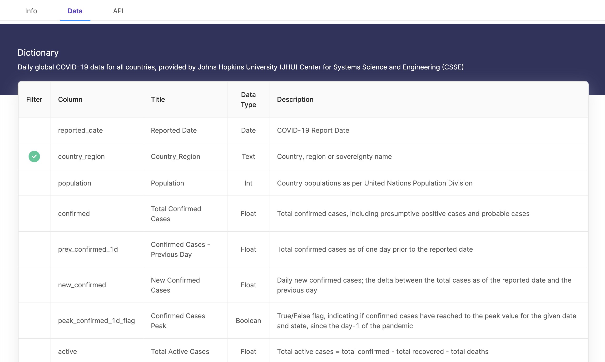

# Test Instructions for Python Library for ALTADATA API

First of all go to [altadata.io](altadata.io) and sign up. Then subscribe one of the free products. After that go to [dashboard](https://www.altadata.io/dashboard) and save your **api_key** this key will be needed when using the library.

Example Data Product: [COVID-19 Worldwide Daily Data](https://www.altadata.io/product/covid-19-worldwide-daily-data-d3c974ec-9c7b-40b3-ac1b-5ddee9c94889)

You should check out the Dictionary part in the data tab of the data product page. Because we can only perform query operations with **filter option active columns**.



You can install the package via [pip](https://pip.pypa.io/en/stable/) or [conda](https://docs.conda.io/en/latest/).

```shell
$ pip install altadata
$ conda install altadata::altadata
```

We currently have pandas dataframe support in the library. Users can optionally retrieve their datasets as pandas dataframe. If **dataframe_functionality** parameter is True function returns pandas dataframe.

> Note: This functionality requires [pandas](https://github.com/pandas-dev/pandas) (v0.25.3 or above) to work.

Read the documentation online at [altadata-python.rtfd.io](https://altadata-python.rtfd.io) and work on data sets using the library.

Then Please answer the **[feedback form](https://forms.office.com/Pages/ResponsePage.aspx?id=njd7j1RRj0qY6FAltKy4XM6WO_CqziJMqMzOBGzrgwhUQVVPUlFUMVNJUzdMS0dTTUVLWkdWUVpUTi4u)** without hesitation.

Thanks for your time.

## Additional Links

- [PyPI Page](https://pypi.org/project/altadata/)
- [Anaconda Cloud Page](https://anaconda.org/altadata/altadata)
- [GitHub Repository](https://github.com/altabering/altadata-python)