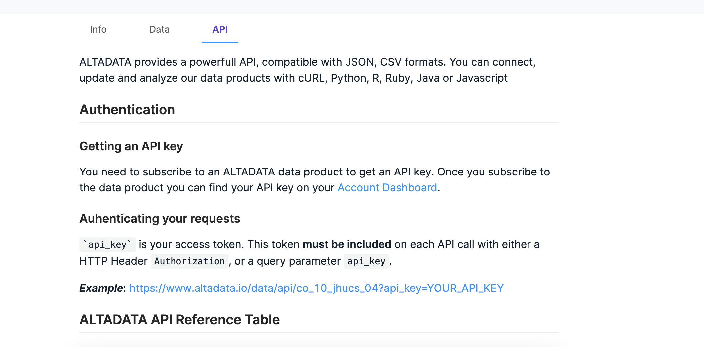

# Test Instructions for Ruby Library for ALTADATA API

First of all go to [altadata.io](altadata.io) and sign up. Then subscribe one of the free products. After that go to [dashboard](https://www.altadata.io/dashboard) and save your **api_key** because this key will be needed when using the library.

Example Data Product: [COVID-19 Worldwide Daily Data](https://www.altadata.io/product/covid-19-worldwide-daily-data-d3c974ec-9c7b-40b3-ac1b-5ddee9c94889)

You should check out the API tab of the data product page. Because we need **product_code** to get the dataset with the library. You can find in the example API request URL before the **api_key** keyword. 

The product code for the example below is **co_10_jhucs_04**



You should check out the Dictionary part in the data tab of the data product page. Because we can only perform query operations with **filter option active columns**.


Add this line to your application's Gemfile:

```ruby
gem 'altadata'
```

And then execute:

```shell
$ bundle install
```

Or install it yourself as:

```shell
$ gem install altadata
```

Read the documentation online at the library's [GitHub Repository](https://github.com/altabering/altadata-ruby) and work on data sets using the library 

Then Please answer the **[feedback form](https://forms.office.com/Pages/ResponsePage.aspx?id=njd7j1RRj0qY6FAltKy4XM6WO_CqziJMqMzOBGzrgwhUQVVPUlFUMVNJUzdMS0dTTUVLWkdWUVpUTi4u)** without hesitation.

Thanks for your time.

## Additional Links

- [RubyGems Page](https://rubygems.org/gems/altadata)
- [GitHub Repository](https://github.com/altabering/altadata-ruby)